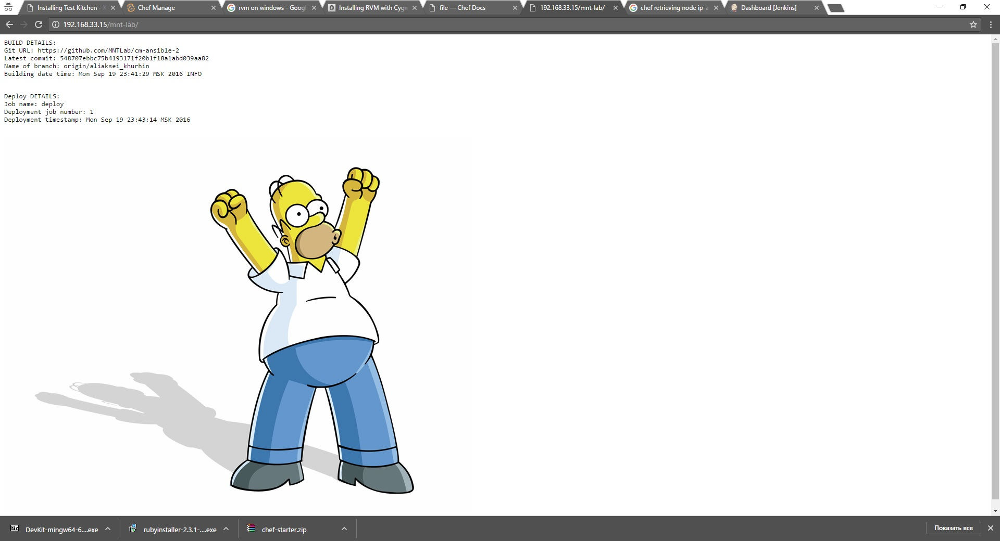
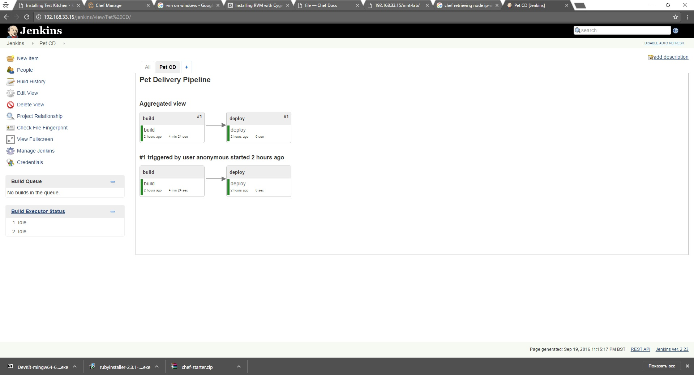

# chef-courses

***Student***: [Aliaksei Khurhin](https://epa.ms/1Cqi0K)

command for chef-run:
knife bootstrap 192.168.33.15 -N web1 -x root -P vagrant -r 'role[test]'

Role includes 3 recipes:
- [tomcat](cookbooks/tomcat/recipes/default.rb) - java installation is one of steps
- [nginx](cookbooks/nginx/recipes/default.rb)
- [jenkins](cookbooks/jenkins/recipes/default.rb) - installation and setting is devided into 3 recipes

I've checked my cookbooks with foodcritic, dut didn't fix errors connected with metadata - perhaps becouse I ahve assebled them with berkshelf (to be improved).

Kitchen check is implemented.

Working application and delivery pipeline:

Thank you for your time. Chef is really interesting framework to work with.
